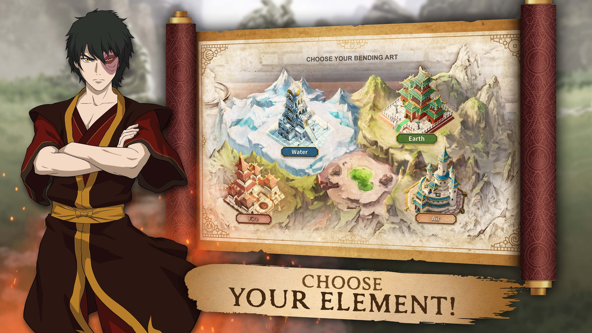
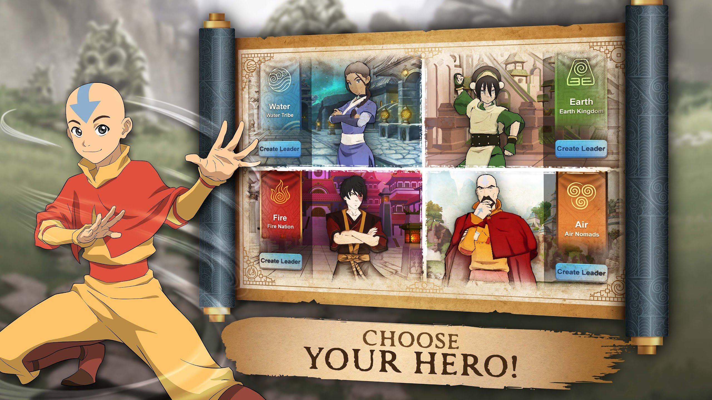
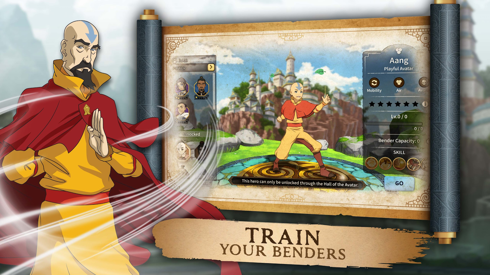
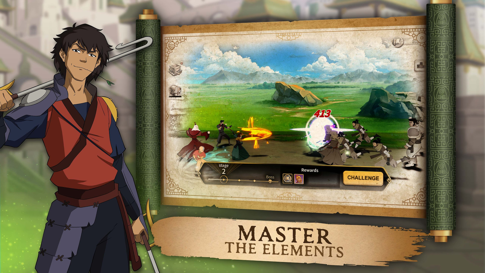
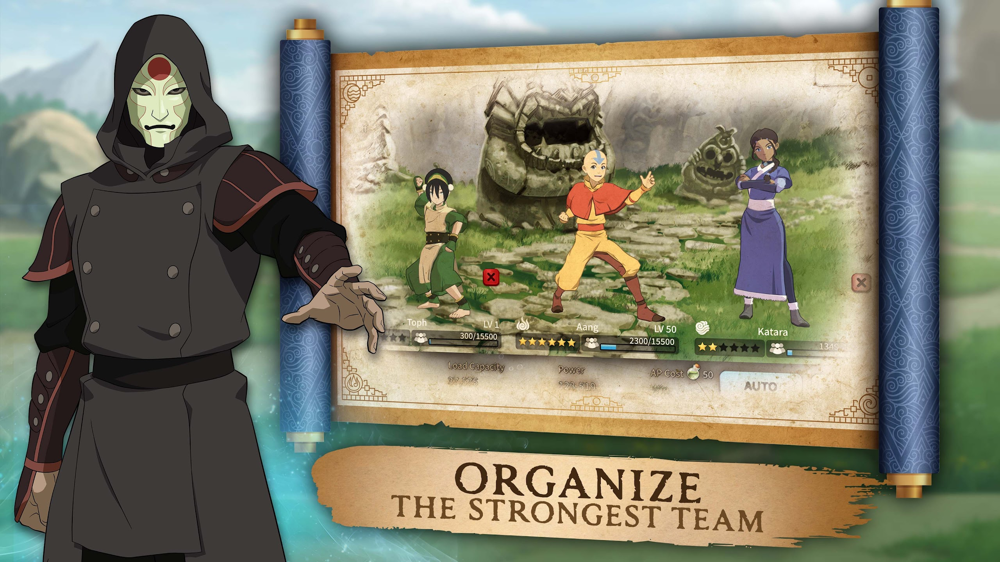
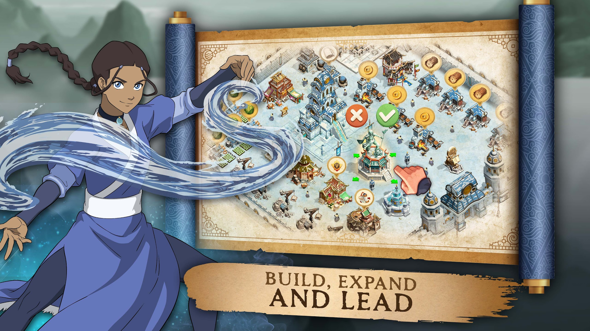
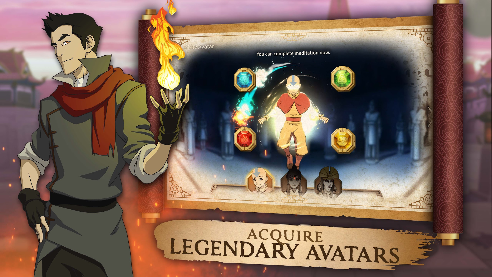
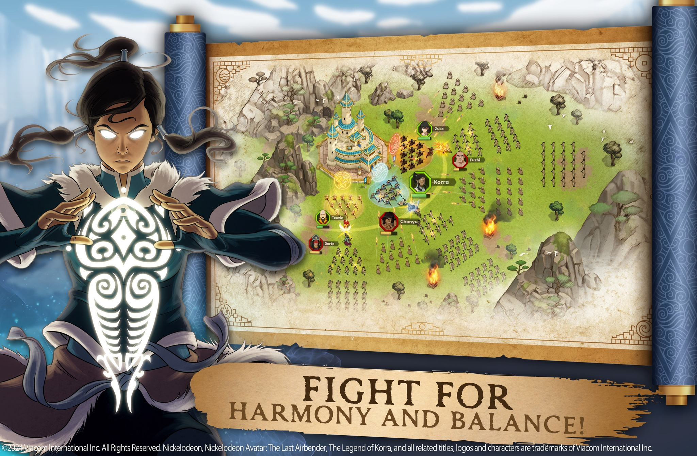
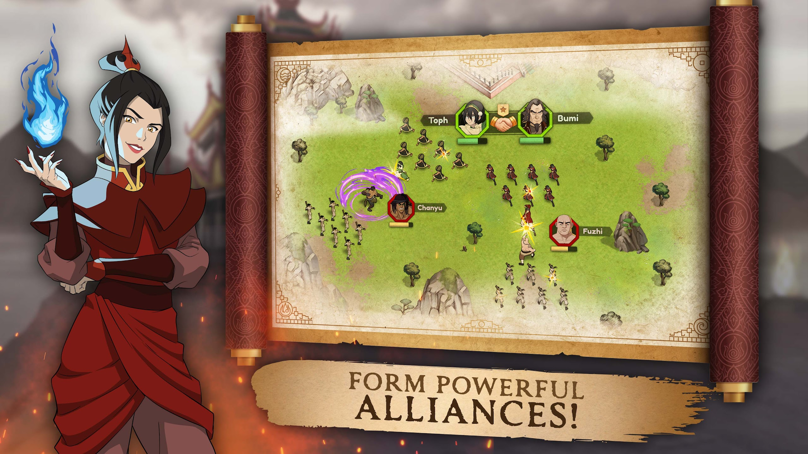

# Adventure Awaits!

> :material-format-quote-open: I hear a calling from beyond. And a chill I can't quite shake. Some sort of sinister force of darkness is coming. I must remain strong for that is the way of the Kyoshi Warrior.
> The Avatar may be responsible for keeping the balance and harmony of the world, but we need all the help we can get! I'm ready to join the fight - are you? :material-format-quote-close:
>
> :feather: Suki

<!-- more -->

---

With the announcement of "Avatar: Realms Collide" there has been a lot of hype building! 

A Kyoshi Warrior is always prepared, so let's review and speculate on everything revealed so far  :smile:

!!! warning

    Please keep in mind the game is still in active development. All screenshots could feature placeholder assets, values, etc... and are always subject to change. 

    It is fun to speculate though!

---

## Choose Your Element

This gives us our first taste of the "4x" strategy gameplay the game is promoting. Players will be able to lead a settlement inspired by one of the bending disciplines. 

The idea of choosing a bending culture sounds really fun! It should make for an engaging community with friendly banter on which element is the strongest.

Also keep that center green colored pool/lake in mind...that could tie into other teasers as we speculate on the overarching story.

---

## Choose Your Hero

Continuing the selection of a bending art, we see this leader selection screen. From game descriptions, we know that leaders are a very important aspect of gameplay. The app listing alone mentions leader 6 times (and heroes 5 times). 

With this, you will definitely have the chance to "collect" or otherwise manage multiple characters. I would bet these are either starting characters or simply a visual example of the characters by culture.

The neat part about Tenzin being featured is that this confirms the realms are colliding! Any Avatar character from a variety of sources could show up at any time. I think we are going to love seeing how this game expands over the coming years.

---

## Train Your Benders

Now we get to characters more in-depth! We see lots of them teased on the left side. Characters have an assigned rarity which should make collecting fun! To pose the question - are rarities/stars fixed by default, or do they increase as characters level up?

The "Unlocked" section gives more insight. Aang is lit up with no #/# below his portrait. And as the text suggests, Avatars are uniquely unlocked through the "Hall of the Avatar." Now check out Azula's portrait with the 0/10 label...I think this indicates how most other characters will be unlocked. They will have their own currencies, such as needing 10 Azula "tokens" or "shards" to unlock her.

Or maybe you can have up to 10 Azulas' - that would be a fierce army!

On the right side, we see Aang with some descriptive attributes, leveling bar, and at least 5 visible skills. This seems pretty standard given the genre. I think there will be a lot of customization options in how you assemble your leaders and armies, which should make for a diverse gameplay experience.

Bender capacity is interesting. Maybe teams can only have so many benders and must be equaled out with nonbenders? Or some characters might be considered stronger so you can't bring all the strong ones together? This could mean a lot of things so I guess we'll have to wait and find out!

---

## Master The Elements

Oh hey, that's me in there - Suki! 

Facing off enemies looks to be a multi-stage effort that leads up to a boss. I would guess the first reward is XP of some kind, maybe scaled by how far you make it. The same banner icon also appears in the top right. 

The button along the left side looks like a statistics preview, which could be the UI element to view character health, abilities, and more.

The big question is how combat will be handled. Just a single "Challenge" button would suggest auto-battling, so customizing your battle approach may be done from the start. Or actions have already have selected by this point and this is just a confirmation button.

---

## Organize The Strongest Team

This next image is fairly similar to the previous character image. With a tag of "Organize the Strongest Team," this could be that customization before entering combat. 

Load capacity sounds similar to bender capacity...in this case, maybe equippable items on characters contribute to this value? Combined with the power stat, I would imagine certain battles must meet prerequisite amounts for balancing encounters.

AP Cost - could that be like "Adventure Points?" With this kind of genre an energy currency makes sense. The Auto button next to that would hint towards autobattling, but it could be a mastery setup where you must progress far enough to be allowed to autobattle. This very much takes me back to the Avatar Generations game for those familiar!

---

## Build, Expand And Lead

A huge shoutout to the artists! All the gameplay images have been awesome, but this image in particular really sticks out :smile:

It has this very hand-drawn, textured look that makes the game beautifully stylized. It would be neat if the paper border look was in-game that fades into color for gameplay, but regardless this is awesome!

A lot of the usual base-building elements are featured, like moving buildings around, generating/collecting resources, central "town hall" buildings, walls, etc...

Wood and coins seem like pretty common resources from the start. There's also these quarry buildings in the bottom left corner that don't have resources generated, but I could see that being stones/rocks. 

We also see cabbages as a food resource in the top left. If we ever have pet/animal companions, this would be the perfect resource for upgrading them!

The paper/cloth icon near the top is interesting. Since there's only 1 building for it, that must be a rarer resource. Initial guesses include - cloth to heal troops, paper for researching troops (like scrolls), or used for higher-tier upgrades of buildings.

The medal V and scroll resource buildings along the bottom are even more mysterious. We see a similar building near the cabbages that looks like an upgrade to the medal V resource building. So that currency might be more frequent. Perhaps this is the mastery/research system for your army?

The dojo along the top (next to wood buildings) looks like a training dojo for...training! I hope we can pre-set different army lineups to mix up strategies.

Finally, check out the statue building that is selected! It reminds me a lot of the Aang statue from Legend of Korra. This could be the "Hall of the Avatar" we've seen mentioned (or a general leader selection interface).

---

## Acquire Legendary Avatars

Here we have the "Hall of the Avatar" UI. This seems to be a separate progression/unlock system from other characters. As expected, we have the 4 elements around the Avatar, possibly learned one by one until you can fully use them.

Let's observe the ordering of Avatars. It's not by era but alphabetical. It could be a coincidence, but I think this hints that we will have some control over which Avatar(s) we pursue first. We don't see Kuruk for instance, but we would expect him to be between Korra and Kyoshi.

Then, we have the interesting text of "complete meditation." We see that Aang has all 4 elements shown while Korra and Kyoshi are grayed out. This could suggest meditation is a perk after unlocking the Avatar and training all elements. I would predict this being a method of generating energy or increasing its cap like we saw in an earlier screenshot.

---

## Fight For Harmony And Balance

More combat now in a top-down view! There seems to be a good mix of strategy in positioning troops and choosing which leaders to lead with. I am curious if bending elements will play a role in matchups, like strength vs weakness charts.

We also have 3 mysterious characters worth noting - Borte, Chanyu, and Fuzhi. These are characters I'll dive more into during the video teaser!

Leaders/characters are followed by different troop types. The elemental symbols glowing around the defending troops look especially cool!

---

## Form Powerful Alliances

This image is similar to the previous one. The notable addition is the alliance symbol between leaders. It seems to be a major part of gameplay - forging alliances between players and groups of settlements.

The 1 star symbol above them...I wonder if that's the standard look for the alliance symbol, or if there's a possible alliance "leveling system" at play. We know that characters have varying rarities, so maybe alliances can be strengthened over time (or it depends on the types of leaders being united).

---

## Villain Sneak Peek: Chanyu

<iframe width="1280" height="720" src="https://www.youtube.com/embed/nEpWrmTNiBs" title="Avatar Legends: Realms Collide - Villain Sneak Peek" frameborder="0" allow="accelerometer; autoplay; clipboard-write; encrypted-media; gyroscope; picture-in-picture; web-share" referrerpolicy="strict-origin-when-cross-origin" allowfullscreen></iframe>

This brings us to our first video teaser - a sneak peek of the villain!

Our villain is named Chanyu, which is one of the three mysterious character names previously seen on the map. At the 0:02 mark we also see two other support characters with Chanyu. Going by the map images, I would assume the left character is Borte and the right is Fuzhi. I am fairly confident on Borte, although Fuzhi does appear a little different compared to the map profile icon, so that could be 2 different, new characters too.

For fun, I did some digging on possible name meanings...

- Chanyu :octicons-arrow-right-16: Ruler, the broad sky, exalted
- Borte :octicons-arrow-right-16: Away, in some other place, ancestral wolf
- Fuzhi :octicons-arrow-right-16: Sharp tongue concealing a caring heart, negative, felicitous omen

Another cool detail is the way Chanyu glows, particularly at the 0:14 mark. His eyes glow green with hints of purple around the pupils. Furthermore, his sholders have a swirl design, also in a green/purple coloring.

We know that this cult is devoted to a dark entity from the Spirit World. My best bet is that the ancient spirit is Father Glowworm, who was first introduced in the Kyoshi novels.

We only have one concept art piece of this spirit from the Avatar Generations game before it was shut down. From what was teased, it had the same green/purple color palette with its singular eye surrounded by a ring pattern. You could also make the suggestion that the (assumed) cult logo at the 0:06 mark resembles tentacles on either side of the skull pattern. Of course, it could be a new spirit entirely and otherwise a mis-direct, but some neat observations nonetheless!

Also recall back to the first image discussed. There was this intriguing green pool between all 4 of the selectable element buildings. This could be another visual indicator of the dark spirit threatening the balance of the Avatar world. I could certainly see the narrative starting here, prompting the establishment of strong settlements to fight back the cult.

---

## Summary

This takes us through all of the visuals published so far.

I can't wait to connect with all of you in-game, once the game releases and the realms collide!

Thanks for reading!
