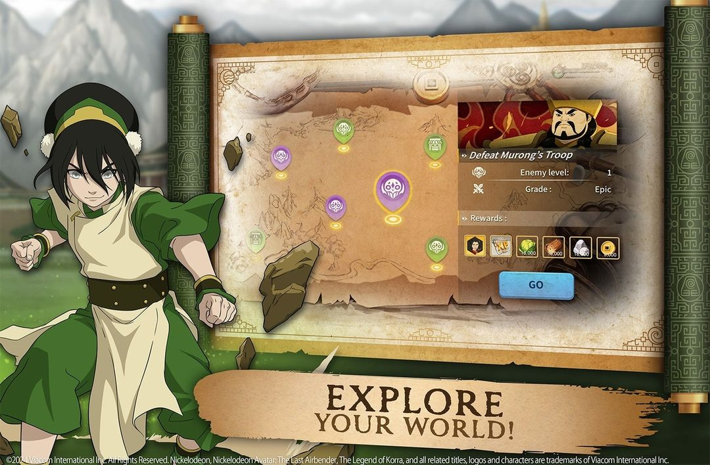

# New Teaser: Explore Your World!

> :material-format-quote-open: An important lesson for Kyoshi Warriors - always be aware of your surroundings. Let's go learn more about these realms! :material-format-quote-close:
>
> :feather: Suki

<!-- more -->

---

Out of the blue, a new teaser for you! 

Today we have a new promo image from official channels - time to analyze :smile:

<figure markdown="span">
    
    <figcaption>This is the latest teaser - super exciting!</figcaption>
</figure>

## Initial Thoughts

This image depicts a map of selectable encounters with scaling difficulty and plenty of rewards! There doesn't seem to be a linear path so there may be some strategy in choosing which encounters to tackle first.

The enemy icons bare the same cult mark as seen in the Chanyu sneak peek video above the temple entrance. I love how ancient and threatening it looks! I also can't help but call out the same green/purple color scheme we continue to see with the cult. 

Faded in the background are artifacts such as an air necklace/medallion. If you look near the top right, it almost looks like a GUI icon + meter. From the green-ish coloring, it could be the AP/energy resource seen in one of the earlier character images. There doesn't seem to be a cost though for taking on the selected encounter, so it could be used for something else entirely.

The other marker icon looks like a building of some kind - perhaps a trader/shop location? This would be the perfect place to stock up on extra resources or troops!

## New Character

Now, one big question from this teaser - who is Murong? From searching through Avatar wikis, there doesn't seem to be any known records of him. 

This could be another new character we are looking at! Here's the interesting thing - I think this may have been the character on the right side of Chanyu we saw in the Villain sneak peak (0:02). Originally we thought this was Fuzhi whose name came up in another promo image, but even then we noted their map profile image looked different. 

<iframe width="1280" height="720" src="https://www.youtube.com/embed/nEpWrmTNiBs" title="Avatar Legends: Realms Collide - Villain Sneak Peek" frameborder="0" allow="accelerometer; autoplay; clipboard-write; encrypted-media; gyroscope; picture-in-picture; web-share" referrerpolicy="strict-origin-when-cross-origin" allowfullscreen></iframe>

So in terms of new characters, the video (0:02) showcases Borte (left), Chanyu (middle), and Murong (right). Then, we know there's a fourth character by the name of Fuzhi from another image. Like the last post, here are some compiled name meanings for fun.

- Murong :octicons-arrow-right-16: Inspirational, idealistic, fascination for mystery/supernatural, wise and martial

## Sweet Rewards

Finally, let's check out those awesome rewards pictured!

The first appears to be an Azula token/shard. We saw in a previous image that some characters (like Azula specifically!) showed a #/# notation below their image. I think this further confirms we will need to collect a certain number of tokens per character in order to unlock them. Some will come from these fights - perhaps there will be other sources as well?

The XP icon makes sense - we maybe thought the scroll icon in the base-building image was XP, but that looks to be a separate item now. 

We can confidently name the other resources though! We noticed recently that the pre-registration rewards were listed by name. So from the latest teaser, going from left to right, we have food, wood, stone, and gold. Stone would line up with those quarry/mine buildings we also saw in the base-building image. 

We do know there are 2 rarer resources not pictured in the teaser - gems and silver scrolls.

## Summary

Turns out we can gather a lot of info from just one new image. Glad to see more news being shared - the hype is real!

I can't wait to connect with all of you in-game, once the game releases and the realms collide!

Thanks for reading!
