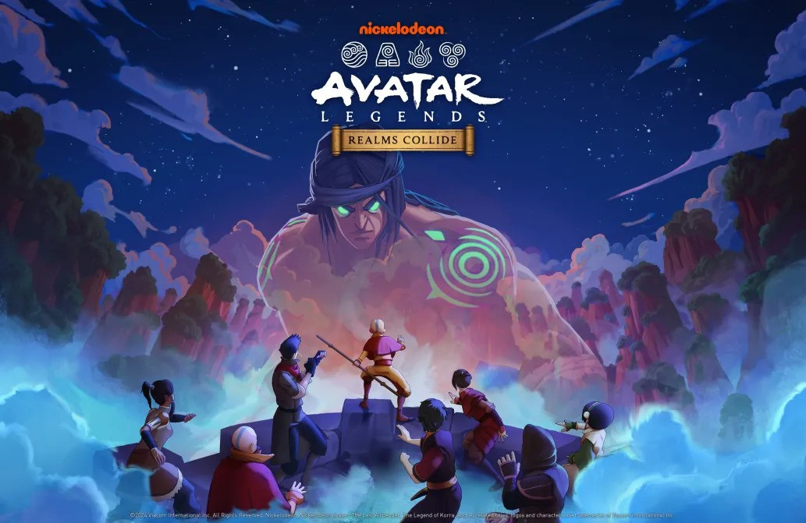

# Dev Update: "Limited Technical Tests"

> :material-format-quote-open: I would not be where I am without strong training - testing will be an important strategy in our preparation for the realms colliding! :material-format-quote-close:
>
> :feather: Suki

<!-- more -->

---

## Announcement

Two days of news in a row - it's a good day for all things Avatar: Realms Collide!

Of course, it's always neat to see new imagery :smile:

And this is the official statement that follows:
  

> :material-format-quote-open: 🌊 Attention, @everyone! Next Steps in Development Phase 🔥
> 
> We have news about the upcoming stages in the development of Avatar Legends: Realms Collide! We are going to start with limited technical tests in select countries to improve the game's quality. As the game is still in its development phase, these technical tests will help us identify and address any bugs that may arise. Please note that these tests will not be available in all regions, but rather in specific countries; therefore, you may hear about these tests.
> 
> We believe in transparency and want to ensure you're well informed. Keeping the community updated is one of our top priorities. Finally, if new tests are available in the future, we will inform you through our social media channels.
> 
> Your understanding and support during this phase are greatly appreciated.
>
> 🌪️ Stay tuned for further updates and announcements! 🗻 :material-format-quote-close:
>
> :speech_left: Bendersama (A:RC Discord)

## Initial Thoughts

It sounds like this limited-regional testing will allow developers to identify bugs, trial gameplay mechanics to select audiences, and stress test certain bits of infrastructure.

While this does not give us any specific dates, it does mean development is going well. We can certainly appreciate the transparency and desire to keep the community well-informed. This is the kind of information that assures us when the game releases, it's going to be fun!

## Additional Details

The following is worth noting:

- This is not a true Beta test cycle. That could come later or they jump into full release - no direct comment has been given on this yet.
- Any sort of game progress is not saved, so there's no advantage given to those testing.
- If the game is not available in Google Play, then your region is not part of the technical test.
- There does not appear to be any sort of enrollment process. It's either available in the app store for a limited time or not.
- This testing has already begun for certain groups, although it's not clear who/where yet.

Thanks for reading!