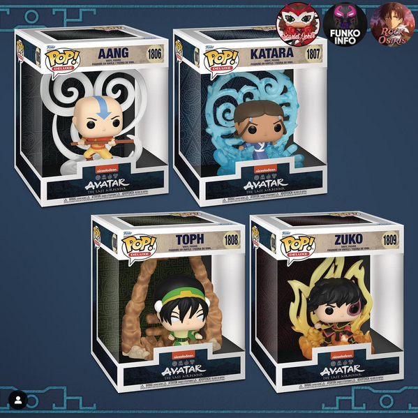
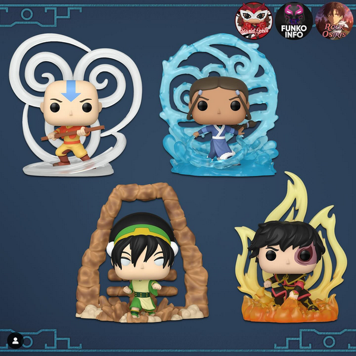

# NEW: Avatar Deluxe Funko Figures

> Today we got our first look at the latest line of Avatar figures for Funko fans!

<!-- more -->

---

The Avatar line of Funko figures continues to be a popular collectible for us Avatar fans!

It's no surprise that more are on the way - this time with a "Deluxe" label :smile:

This was previously rumored roughly 8 months ago, so it's exciting to see some images now!

## Box Image

<figure markdown="span">
    
    <figcaption>Neat box visual for these new Avatar Deluxe Funko figures!</figcaption>
</figure>

Here we can see the four different figures

- Figure 1806: Aang (Deluxe)
- Figure 1807: Katara (Deluxe)
- Figure 1808: Toph (Deluxe)
- Figure 1809: Zuko (Deluxe)

The branding is consistent with other Avatar merchandise with the blue/brown parchment look and elemental symbols forming a mosaic-esque background.

Most notably though are the new bending symbols styled after the respective elements behind each figure. It's a unique way to make these figures feel "deluxe"

I do hope the pricing is fairly reasonable on these. At the very least, they should (ideally) be more obtainable than the NFT route taken previously with Avatar Funko!

## Figure Image

<figure markdown="span">
    
    <figcaption>Another look at the characters and their stands up close!</figcaption>
</figure>

And here is a more detailed picture of the figures!

If I had to pick a favorite, I would go with Zuko. His outfit certainly looks more detailed, plus his fire symbol has a nice gradient to it that actually feels like fire.

Katara's water symbol sort of looks "soap-y" if that makes sense :laughing: but that could just be me! And the earth symbol behind Toph has a cheaper look to it, but that may just be how the rendering appears.

## Final Thoughts

Overall this is an exciting new release for Avatar Funko!

I do also have to throw this thought in - what about Fan & Sword!?! I may be a bit biased of course, but it would be cool to see a Sokka/Suki release with a fan & sword symbol. Or even the non-bender boomerang symbol that has been used more consistently across Avatar media and products the last few years!

Perhaps we could even see sub-bending releases with characters - there is a lot of potential here if these Avatar Deluxe Funko figures happen to be a huge hit :smile: