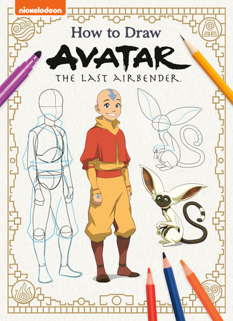
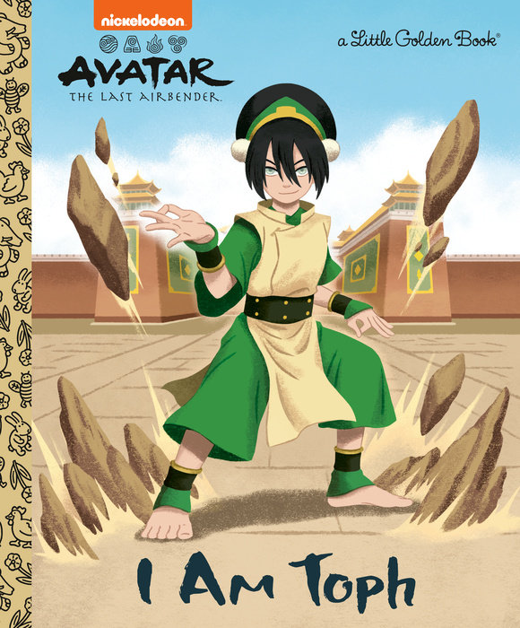
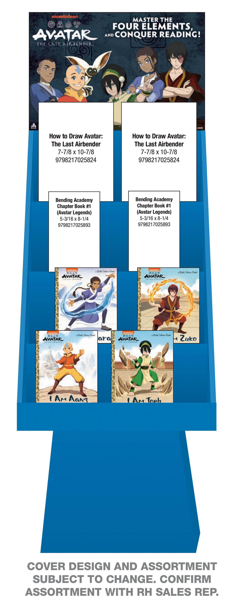

# NEW: "How to Draw" Book & More from Penguin Random House!

> Recently a new "How to Draw Avatar: The Last Airbender" listing was discovered. Alongside other upcoming releases such as a new Bending Academy Chapter Book - Penguin Random House looks to be setting the stage for the youngest of Avatar fans to embrace the element of reading!

<!-- more -->

---

## How to Draw Avatar: The Last Airbender Book

Below is the new "How to Draw Avatar: The Last Airbender" book cover.[^1]

<figure markdown="span">
    
    <figcaption>Elegant front cover for How to Draw Avatar!</figcaption>
</figure>

__Product Description__:

> __Learn to draw your favorite characters from Nickelodeon’s hit show <i>Avatar: The Last Airbender</i>!__
>
> In this full-color <i>How to Draw</i> activity book, <i>Avatar: The Last Airbender</i> fans of all ages can learn to draw their favorite characters—from Aang to Katara to Zuko and more! This book features step-by-step illustrated instructions that demonstrate how to turn basic shapes into detailed drawings. Perfect for young artists 7 to 10—and Avatar fans of all ages, this is a fun way to bring your favorite characters to life on paper!

---

__Listing Info__:

- USD price of $12.99
- Expected release date: July 1st, 2025
- ISBN: 9798217025824
- Target age: 7-10 years
- Illustrations by: [Patrick Spaziante](https://www.penguinrandomhouse.com/authors/102907/patrick-spaziante/) (1)

1.  :man_raising_hand: Patrick Spaziante is an American comic book artist known for his work for Archie Comics, in particular his interior pencil and cover work for <i>Sonic the Hedgehog</i>, <i>Sonic X</i> and <i>Sonic Universe</i>.

---

As someone who enjoys drawing, but has zero clue on where to start with the Avatar style, I think this book is perfect!

If you happen to search Google, Youtube, etc... for drawing Avatar, there are dozens of results over the years. So the demand is certainly there from fans! I was curious if similiar products have been made before, and the most I could find was a "Licensed Learn to Draw" book for Avatar dating back to 2007, so it's nice to see a more official drawing book under the Avatar Studios banner now.

## Little Golden Books

Continuing the Penguin Random House Avatar lineup are the "I Am..." Little Golden Books.

Over the last few years 3 Avatar Little Golden Books have been released. These include:

- I Am Aang[^2] - Released May 2nd, 2023
- I Am Zuko[^3] - Released January 2nd, 2024
- I Am Katara[^4] - Released June 18th, 2024

If you are thinking "where's earth?" then you would be correct! - Coming earlier next year is the fourth book: "I Am Toph"[^5]

<figure markdown="span">
    
    <figcaption>Epic front cover of Toph in the classic earthbending pose!</figcaption>
</figure>

__Product Description__:

> __This exciting Little Golden Book introduces Toph from Nickelodeon’s <i>Avatar: The Last Airbender</i>!__
>
> Born into a wealthy family, 12-year-old Toph Beifong was expected to become a young woman of society. What nobody expected was that she would be one of the best Earthbenders in the four nations! Follow Toph’s journey from competing in earthbending rumbles in secret as The Blind Bandit to travelling the world as the Avatar’s earthbending master. This beautifully-illustrated Little Golden Book is perfect for children ages 2 to 5 and Avatar superfans of all ages!

---

__Listing Info__:

- USD price of $5.99
- Expected release date: January 7th, 2025
- ISBN: 9780593902318
- Target age: 2-5 years
- Page Count: 24
- Written by: [Mei Nakamura](https://www.penguinrandomhouse.com/authors/2265655/mei-nakamura/)
- Illustrations by: [Bao Luu](https://www.penguinrandomhouse.com/authors/2198953/bao-luu/)

---

Kids are certainly going to love this, and for fans of all ages the illustrations are always a treat!

It will be interesting to see the direction they take with these Little Golden Books. Will they expand to more ATLA characters? Jump later into Korra? Travel back to past Avatars?

## Bending Academy

Kids have a lot to look forward to with Avatar! Not only is there a drawing book and another Little Golden Book planned, but also a brand-new chapter book series on the horizon titled "Bending Academy"[^6]

__Product Description__:

> __The first in a chapter book series exploring an adventure in the <i>Avatar: The Last Airbender</i> universe!__
>
> Set in the world of the beloved series <i>Avatar: The Last Airbender</i>, this all-new chapter book series introduces a new group of kids attending a bending academy in the Earth Kingdom. This action-packed book—the first in the series—is perfect for readers ages 6 to 9 and <i>Avatar</i> fans of all ages!
>
> This is the first book in a new chapter book series! For Avatar in Summer 2025, we have an LGB, a Screen Comix, a How to Draw, and a chapter book.

---

__Listing Info__:

- USD price of $10.99
- Expected release date: July 1st, 2025
- ISBN: 9798217025893
- Target age: 6-9 years (Grades 1 to 4)
- Page Count: 144

---

Unfortunately no cover or author/other details are known yet, and we are not sure how many book are planned.

From the description alone though, this is a very exciting release! Based on the other books here, this will likely take place in Aang's era. If I had to guess, this would be post-series, so an exploration of school (and life) after the war has ended.

While it's aimed for kids, I think there could be some really interesting contributions to the Avatar storyline that all fans can appreciate. We may see the effects of war from a kid's perspective, learn more about the culture of the Earth Kingdom, and explore how bending is taught at a young age!

Academy life specific to the Fire Nation is also being explored in the upcoming "Ashes of the Academy"[^7] stand-alone graphic novel from Dark Horse. And we know it is a significant part of character backstories like in the Kyoshi novels. It really seems that Avatar Studios has further fleshed out the "academic" side of Avatar lore, and it makes us wonder how that might relate to future projects!

That last line in the description is interesting too - we know about the drawing book, LGB, and this chapter book, but Screen Comix I don't believe there have been recent listings. For those unfamiliar, these are graphic novel retellings of the Avatar series. To date, there have been four published, with the latest one titled "The Power of Toph" released back in Janurary 3rd, 2023. So we may see a return of this series heading into 2025 and beyond!

## Book Display

With all of these releases from Penguin Random House aimed towards kids, they should really have a dedicated stall to market with, right? Indeed!

Also from the Bending Academy listing is an attachment to a store display mockup:

<figure markdown="span">
    
    <figcaption>A dedicated book display for Avatar? - Nice!</figcaption>
</figure>

Avatar Studios is looking to "ramp up" content in 2025 after years of building out an entire studio, so to see this level of marketing ahead is good evidence of that hard work :smile:

## Final Thoughts

This much content from just one publishing angle (of many) from Avatar Studios is a great sign!

They really look to be tapping into the younger audience, and introducing Avatar to an entirely new generation. This means the fanbase will continue to grow as more media projects are planned in the future!

[^1]: How to Draw Avatar: The Last Airbender - [Publisher Listing Link](https://www.penguinrandomhouse.com/books/775926/how-to-draw-avatar-the-last-airbender-by-random-house-illustrated-by-patrick-spaziante/)
[^2]: I Am Aang - [Publisher Listing Link](https://www.penguinrandomhouse.com/books/672540/i-am-aang-avatar-the-last-airbender-by-mei-nakamura-illustrated-by-bao-luu/)
[^3]: I Am Zuko - [Publisher Listing Link](https://www.penguinrandomhouse.com/books/734338/i-am-zuko-avatar-the-last-airbender-by-mei-nakamura-illustrated-by-bao-luu/)
[^4]: I Am Katara - [Publisher Listing Link](https://www.penguinrandomhouse.com/books/739872/i-am-katara-avatar-the-last-airbender-by-mei-nakamura-illustrated-by-bao-luu/)
[^5]: I Am Toph - [Publisher Listing Link](https://www.penguinrandomhouse.com/books/767876/i-am-toph-avatar-the-last-airbender-by-mei-nakamura-illustrated-by-bao-luu/)
[^6]: Bending Academy Chapter Book #1 (Avatar Legends) - [Edelweiss Listing Link](https://www.edelweiss.plus/#sku=9798217025893&page=1)
[^7]: Ashes of the Academy - [Dark Horse Listing Link](https://www.darkhorse.com/Books/3009-127/Avatar-The-Last-Airbender--Ashes-of-the-Academy-TPB)